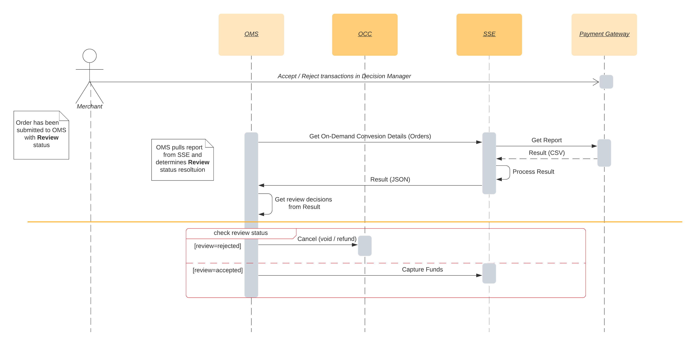

# Reporting <!-- omit in toc -->

1. [Description](#description)
2. [Implementation Details](#implementation-details)
   1. [Backend (SSE) integration details](#backend-sse-integration-details)

## Description

Reporting APIs exposed from SSE provide additional services to facilitate Decision Management and manual transaction reviews

Please refer to the [Reporting REST API](https://developer.cybersource.com/api-reference-assets/index.html#reporting) to get more details about available reports

Existing SSE reporting endpoints act as a wrapper around PSP REST APIs in order to simplify the integration for SIs and help unifying interaction flow so that SSE becomes a single point of PSP integration.

The following reports are being handled by SSE:

- On-demand conversion - report that provides conversion data on-demand.
- Daily conversion - report that can be scheduled for daily execution.

## Implementation Details

SSE exposes two API endpoints which generate DM reports

| **Endpoint**                                      | **Description**                                                                                                                                                                                                                                                        |
|---------------------------------------------------|------------------------------------------------------------------------------------------------------------------------------------------------------------------------------------------------------------------------------------------------------------------------|
| `/ccstorex/custom/isv-payment/v2/report/daily`    | Returns conversion report for a given date. A wrapper around [Reports Download API](https://developer.cybersource.com/api-reference-assets/index.html#reporting_report-downloads_download-a-report). Downloads report with `ConversionDetailReport_Daily_Classic` name. Controlled by `dailyReportName` gateway setting |
| `/ccstorex/custom/isv-payment/v2/report/onDemand` | Returns conversion report for a start and end dates.  A wrapper around [Get Conversion Detail Transactions](https://developer.cybersource.com/api-reference-assets/index.html#reporting_conversion-details_get-conversion-detail-transactions)                         |

Both endpoints return reports in same JSON format, e.g.

```json
[
    {
        "merchantReferenceCode": "o30446",
        "newDecision": "ACCEPT",
        "originalDecision": "REVIEW"
    }
]
```

The report above marks a transaction with `merchantReferenceCode` (Order ID) 'o30446' manually reviewed and accepted in DM.
Fulfillment can proceed with further actions based on available decision.



 Please notice from the diagram above how fulfillment can proceed with capturing or cancelling  payments  based on Review decisions.

### Backend (SSE) integration details

In the table below you can find related codebase artifacts for handling reporting logic:

| **Location**                                                           | **Description**                                                                                         |
|------------------------------------------------------------------------|---------------------------------------------------------------------------------------------------------|
| `packages/server-extension/src/controllers/report.ts`                  | Controller for both  On-Demand and Daily reports                                                        |
| `packages/server-extension/src/controllers/validation/reportSchema.ts` | Input validation rules for Reporting endpoints                                                          |
| `packages/server-extension/src/services/payments/reports/index.ts`     | Service  layer logic which submits reporting request and converts results  into common  response format |