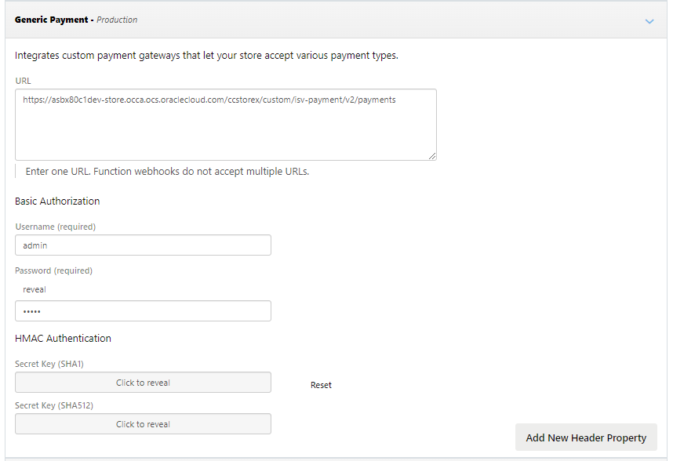

# Installation <!-- omit in toc -->

1. [Prerequisites](#prerequisites)
2. [Install Payment Gateway](#install-payment-gateway)
   1. [Configure gateway](#configure-gateway)
   2. [Deploy](#deploy)
   3. [Enable gateway in OCC Admin](#enable-gateway-in-occ-admin)
3. [Configure Generic Webhooks](#configure-generic-webhooks)
4. [Install SSE (server-extension)](#install-sse-server-extension)
   1. [Configure](#configure)
   2. [Deploy](#deploy-1)
5. [Install Payment Widget (payment-widget)](#install-payment-widget-payment-widget)
   1. [Deploy](#deploy-2)
   2. [Add widget to Checkout layout](#add-widget-to-checkout-layout)
6. [Install Saved Cards Widget (saved-cards-widget)](#install-saved-cards-widget-saved-cards-widget)
   1. [Deploy](#deploy-3)
   2. [Add widget to My Account layout](#add-widget-to-my-account-layout)
7. [Test deployed widgets in OCC Storefront](#test-deployed-widgets-in-occ-storefront)

This section summarizes the installation process of OCC payment plugin.

Before going into installation steps please take a look at the following documents:

- [Working with Commerce Cloud Server-Side Extensions](https://community.oracle.com/groups/oracle-commerce-cloud-group/blog/2017/07/21/working-with-commerce-cloud-server-side-extensions)
- [Create and load the extension bundle](https://docs.oracle.com/en/cloud/saas/cx-commerce/20c/widge/create-and-load-extension-bundle.html)

Please pay attention to installation steps documented for both SSE and widgets (extensions). Payment plugin contains usefull scripts which automate the installation process using `yarn occ` CLI tool.

## Prerequisites

The following is required before going through installation steps:

1. Yarn version: [1.22.4](https://classic.yarnpkg.com/en/docs/install/#mac-stable)
2. NodeJS version: 10.18.0, You could use [NVM](https://github.com/nvm-sh/nvm) to manage multiple versions locally
3. OCC environment
    - OCC Admin interface: https://ccadmin-{env}.oracleoutsourcing.com/occs-admin/
    - OCC Storefront: https://ccstore-{env}.oracleoutsourcing.com/
4. [Application Key](https://docs.oracle.com/en/cloud/saas/cx-commerce/20c/ccdev/register-applications.html)
5. User credentials for OCC Admin

Install all dependencies by running `yarn instal` from the project's root.

You can also build all packages at once using `yarn build:prod` command.

## Install Payment Gateway

### Configure gateway

Before installing payment gateway you should decide whether you will support all payment methods or only some of it. There are two ways you can manage it:

1. Disabling payment type from OCC Admin interface which will result in payment option not being rendered in UI (Payment Widget)
2. Removing unrelated configuration properties from `packages/payment-gateway/gateway/isv-occ-gateway/config/config.json`

 In most cases just disabling unsupported payment type from OCC Admin is preferable. Removing unsupported configuration properties can be done in case particular payment types (e.g. GooglePay) should be initially excluded from OCC Admin interface.

To remove unrelated properties please consider the following:

1. To exclude **GooglePay** payment settings remove the following from `packages/payment-gateway/gateway/isv-occ-gateway/config/config.json`
    - configuration properties: `googlePaySdkUrl`,`googlePayEnvironment`, `googlePayGateway`,`googlePayGatewayMerchantId`,`googlePayMerchantId`
    `googlePayMerchantName`,`googlePaySupportedNetworks`
    - Remove `googlepay` option from following properties: `paymentOptions`, `saleEnabled`, `dmDecisionSkip`
2. To exclude **ApplePay** payment settings remove the following from `packages/payment-gateway/gateway/isv-occ-gateway/config/config.json`
    - configuration properties: `applePayMerchantId`,`applePayInitiative`, `applePayInitiativeContext`,`applePaySupportedNetworks`
    - Remove `applepay` option from following properties: `paymentOptions`, `saleEnabled`, `dmDecisionSkip`

After adjusting payment gateway settings you should also remove respective properties from `packages/payment-gateway/settings.json`.

### Deploy

To deploy `payment-gateway` extension run the following command

```bash
yarn occ upload-extension payment-gateway --url ${OCC_ADMIN_HOST} --username ${OCC_USERNAME} --password ${OCC_PASSWORD} -x settings.json
```

where

- `url` - points  to your OCC Admin environemnt URL
- `OCC_ADMIN_HOST` - your OCC specific environment, e.g. `ccadmin-{env}.oracleoutsourcing.com`
- `OCC_USERNAME` - OCC username
- `OCC_PASSWORD` - OCC password
- `-x` option excludes sample settings from deployment artefact

### Enable gateway in OCC Admin

After successful deployment you will need to enable payment gateway:

- Go to OCC Admin -> Settings -> Payment Processing
- Open 'Payment gateways' tab and choose 'ISV OCC Gateway' from the list
- Select 'Payment Gateway Enabled' option
- Configure gateway settings by providing values (e.g. merchant credentials) for particular channel (Preview, Storefront, Agent)
- Save Changes
- Go back to the 'Payment Types' type
- Select supported credit card types from the list
- You might want  to also provide list of supported billing countries as well as default one
- Save Changes

## Configure Generic Webhooks

You should setup Generic Payment so that OCC knows where to send payment requests. See the 'Understand function webhooks' section from the [Understand webhooks](https://docs.oracle.com/en/cloud/saas/cx-commerce/20c/ccdev/understand-webhooks.html) document

- Open OCC Admin and got to Settings -> Web APIs -> Function APIs
- Configure both Generic Payment Production and Preview webhooks as shown below 
- Please replace URL (the `{env}` part) with your specific value
- Make sure you copy secret key as it will be required for SSE deployment

## Install SSE (server-extension)

### Configure

Configure production settings in the following file `packages/server-extension/config/app.prod.json`:

- `cache.service.ttl.secs` - Default caching TTL, can be zero value
- `cache.gatewaysettings.ttl.secs` - Caching TTL for gateway settings call (see `packages/server-extension/src/middlewares/gatewaySettings.ts`). You might want to use TTL value '1' while testing SSE so that changes in gateway settings performed in OCC Admin become immediately available to SSE and Payment Widget respectively
- `crypto.service.key` - Random key which is used to encrypt data so that it is not tampered in UI
- `partner.developerId` - Leave the value as is
- `partner.solutionId` - Leave the value as is
- `logging.webhook.http` - Enable webhook request/response logging
- `logging.api.error` - Enable logging for errors
- `logging.api.access` - Enable logging for incoming requests
- `/isv-payment/v1/payments` - Webhook secret key

 `packages/server-extension/config/app.local.json` is applied only in local development environment

### Deploy

Build SSE extension with the following command

```bash
cd packages/server-extension
yarn build:prod
```

Deploy SSE by running commands (from project's root):

```bash
yarn occ package-app payment-sse
yarn occ upload-app -u ${OCC_ADMIN_HOST} -k ${APPLICATION_KEY} payment-sse
```

where

- `APPLICATION_KEY` - Application Key created in Settings -> Web APIs ->  Registered Applications
- `OCC_ADMIN_HOST` - your OCC specific environment, e.g. `ccadmin-{env}.oracleoutsourcing.com`

## Install Payment Widget (payment-widget)

### Deploy

Build widget with the following command

```bash
cd packages/payment-widget
yarn build:prod
```

Deploy widget by running commands (from project's root):

```bash
yarn occ upload-extension payment-widget --url ${OCC_ADMIN_HOST} --username ${OCC_USERNAME} --password ${OCC_PASSWORD} -x widget/isv-occ-payment/js/__tests__
```

where

- `OCC_ADMIN_HOST` - your OCC specific environment, e.g. `ccadmin-{env}.oracleoutsourcing.com`
- `OCC_USERNAME` - OCC username
- `OCC_PASSWORD` - OCC password
- `-x` excludes tests from the deployed artefact

### Add widget to Checkout layout

See [Developing a Custom Widget in Oracle Commerce Cloud](https://community.oracle.com/groups/oracle-commerce-cloud-group/blog/2019/04/24/developing-a-custom-widget-in-oracle-commerce-cloud) on how a particular widget can be added to the layout:

- Go to OCC Admin -> Design -> Layouts and filter 'Checkout' layouts
- Add 'ISV OCC Payment' widget to one of the layouts


## Install Saved Cards Widget (saved-cards-widget)

### Deploy

Build widget with the following command

```bash
cd packages/saved-cards-widget
yarn build:prod
```

Deploy widget by running commands (from project's root):

```bash
yarn occ upload-extension saved-cards-widget --url ${OCC_ADMIN_HOST} --username ${OCC_USERNAME} --password ${OCC_PASSWORD} -x widget/saved-cards/js/__tests__
```

where

- `OCC_ADMIN_HOST` - your OCC specific environment, e.g. `ccadmin-{env}.oracleoutsourcing.com`
- `OCC_USERNAME` - OCC username
- `OCC_PASSWORD` - OCC password
- `-x` excludes tests from the deployed artefact

### Add widget to My Account layout

- Go to OCC Admin -> Design -> Layouts and filter 'Shopper Profile' layouts
- Add 'ISV Saved Cards' widget to one of the profile layouts


## Test deployed widgets in OCC Storefront

In order to be able to see uploaded and configured widgets working in OCC Storefront you will need to Publish changes:

- Go to OCC Admin -> Publishing
- Publish all recently introduced changes
- You should be able to see widgets in OCC Storefront afterwards (e.g. `ccstore-{env}.oracleoutsourcing.com`)