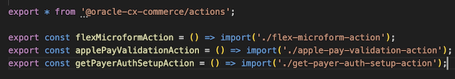
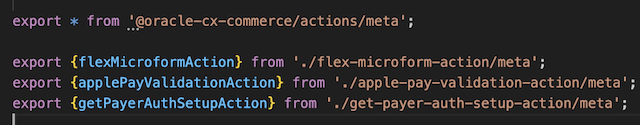

# Installation <!-- omit in toc -->

1. [Prerequisites](#prerequisites)
2. [Install Payment Gateway](#install-payment-gateway)
   1. [Configure gateway](#configure-gateway)
   2. [Deploy](#deploy)
   3. [Enable gateway in OCC Admin](#enable-gateway-in-occ-admin)
3. [Configure Generic Webhooks](#configure-generic-webhooks)
4. [Install SSE (server-extension)](#install-sse-server-extension)
   1. [Configure](#configure)
   2. [Deploy](#deploy-1)
5. [Install Payment Widget (payment-widget)](#install-payment-widget-payment-widget)
   1. [Deploy](#deploy-2)
   2. [Add widget to Checkout layout](#add-widget-to-checkout-layout)
6. [Test deployed widgets in OCC Storefront](#test-deployed-widgets-in-occ-storefront)

This section summarizes the installation process of OCC payment plugin.

Before going into installation steps please take a look at the following documents:

- [Working with Commerce Cloud Server-Side Extensions](https://community.oracle.com/groups/oracle-commerce-cloud-group/blog/2017/07/21/working-with-commerce-cloud-server-side-extensions)
- [Develop and Deploy applications OSF](https://docs.oracle.com/en/cloud/saas/cx-commerce/21d/dosfa/develop-and-deploy-applications1.html)

Please pay attention to installation steps documented for both SSE and widgets (extensions). Payment plugin contains usefull scripts which automate the installation process using `yarn occ` CLI tool.

## Prerequisites

The following is required before going through installation steps:

1. Yarn version: [1.22.4](https://classic.yarnpkg.com/en/docs/install/#mac-stable)
2. NodeJS version: 18.16.1, You could use [NVM](https://github.com/nvm-sh/nvm) to manage multiple versions locally
3. OCC environment
    - OCC Admin interface: https://asbx80c1dev-admin-{env}.oraclecloud.com/occs-admin/
    - OCC Storefront: https://asbx80c1dev-store-{env}.oraclecloud.com
4. [Application Key](https://docs.oracle.com/en/cloud/saas/cx-commerce/21d/ccdev/register-applications.html)
5. User credentials for OCC Admin


Install all the dependencies by running `yarn install` from the project's root.

You need to build all packages at once using `yarn build:prod` command from project's root.

## Install Payment Gateway

### Configure gateway

Before installing a payment gateway you should decide whether you will support all payment methods or only some. There are two ways it can be managed: 

1. Disabling payment type from OCC Admin interface which will result in the payment option not being rendered in UI (Payment Widget)
2. Removing unrelated configuration properties from `packages/payment-gateway/gateway/isv-occ-gateway/config/config.json`

 In most cases just disabling unsupported payment type from OCC Admin is preferable. Removing unsupported configuration properties can be done in case particular payment types (e.g. GooglePay) should be initially excluded from OCC Admin interface.

To remove unrelated properties please consider the following:

1. To exclude **GooglePay** payment settings remove the following from `packages/payment-gateway/gateway/isv-occ-gateway/config/config.json`
    - configuration properties: `googlePaySdkUrl`,`googlePayEnvironment`, `googlePayGateway`,`googlePayGatewayMerchantId`,`googlePayMerchantId`
    `googlePayMerchantName`,`googlePaySupportedNetworks`
    - Remove `googlepay` option from following properties: `paymentOptions`, `dmDecisionSkip`
2. To exclude **ApplePay** payment settings remove the following from `packages/payment-gateway/gateway/isv-occ-gateway/config/config.json`
    - configuration properties: `applePayMerchantId`,`applePayInitiative`, `applePayInitiativeContext`,`applePaySupportedNetworks`,`applePayDisplayName`
    - Remove `applepay` option from following properties: `paymentOptions`, `dmDecisionSkip`

After adjusting payment gateway settings you should also remove respective properties from `packages/payment-gateway/settings.json`.

### Deploy

#### Create an extension ID
In order to upload an extension into Commerce Cloud, you must generate an ID for the extension and update the same in packages/payment-gateway/ext.json file
To create an extension ID:
- Log into Commerce Cloud.
- Navigate to Settings->Extensions->Developer tab.
- Click on Generate ID button.
- Enter a name for the extension and click Save.
- Copy and update the generated extension ID 

#### Upload Extension
Before uploading the extension, zip up all the files within your packages/payment-gateway directory except settings.json. This is the file you upload to Commerce Cloud to make the extension available for use.
- In the “Settings” tab on the left panel.
- In settings, click on “Extension” button.
- Click the Upload Extension button and select the extension zip file from your local file system.
Once the module is installed, head back to the Oracle Commerce Cloud Admin to configure it.

### Enable gateway in OCC Admin

After successful deployment you will need to enable payment gateway:

- Go to OCC Admin -> Settings -> Payment Processing
- Open 'Payment gateways' tab and choose 'Cybersource Official' from the list
- Select 'Payment Gateway Enabled' option
- Configure gateway settings by providing values (e.g. merchant credentials) for particular channel (Preview, Storefront, Agent)
- Save Changes
- Go back to the 'Payment Types' type
- Select supported credit/debit card types from the list [Possible card types: VISA, MASTERCARD, AMEX, DISCOVER, DINERSCLUB, JCB, CARTESBANCAIRES, MAESTRO, CARNET, CUP] 
- You might want to also provide list of supported billing countries as well as default one
- Save Changes

## Configure Generic Webhooks

You should setup Generic Payment so that OCC knows where to send payment requests. See the 'Understand function webhooks' section from the [Understand webhooks](https://docs.oracle.com/en/cloud/saas/cx-commerce/20c/ccdev/understand-webhooks.html) document

- Open OCC Admin and got to Settings -> Web APIs -> Function APIs
- Configure both Generic Payment Production and Preview webhooks as shown below 
- Please replace URL (the `{env}` part) with your specific value
- Make sure you copy secret key as it will be required for SSE deployment

## Install SSE (server-extension)

### Configure

Configure production settings in the following file `packages/server-extension/config/app.prod.json`:

- `cache.service.ttl.secs` - Default caching TTL, can be zero value
- `cache.gatewaysettings.ttl.secs` - Caching TTL for gateway settings call (see `packages/server-extension/src/middlewares/gatewaySettings.ts`). You might want to use TTL value '1' while testing SSE so that changes in gateway settings performed in OCC Admin become immediately available to SSE and Payment Widget respectively
- `crypto.service.key` - Random key which is used to encrypt data so that it is not tampered in UI
- `partner.developerId` - Leave the value as is
- `partner.solutionId` - Leave the value as is
- `logging.webhook.http` - Enable webhook request/response logging
- `logging.api.error` - Enable logging for errors
- `logging.api.access` - Enable logging for incoming requests
- `payments.secret.key` - Webhook secret key (SHA512)
 
 `packages/server-extension/config/app.local.json` is applied only in local development environment

### Deploy

Build SSE extension with the following command

```bash
cd packages/occ-sse-gateway
yarn build:prod
```

Deploy SSE by running commands (from project's root):

```bash
yarn occ package-app osf-payment-sse
yarn occ upload-app -u ${OCC_ADMIN_HOST} -k ${APPLICATION_KEY} osf-payment-sse
```

where

- `APPLICATION_KEY` - Application Key created in Settings -> Web APIs ->  Registered Applications
- `OCC_ADMIN_HOST` - your OCC specific environment, e.g. `asbx80c1dev-admin-{env}.oraclecloud.com` 

## Install Payment Widget (payment-widget)

### Deploy

1. Copy the contents from cybersource-plugins-oraclecxcommerce/plugins into the plugins directory of your storefront(OSF workspace) code.
Copy plugins/actions into your storefront code and export the actions in the index and meta files:

plugins/actions/index.js


plugins/actions/meta.js


Copy plugins/components into your storefront code and export the components in the index and meta files:

plugins/components/index.js


plugins/components/meta.js


Copy plugins/endpoints into your storefront code and export the endpoints in the index and meta files:

plugins/endpoints/index.js


plugins/endpoints/meta.js


Copy plugins/selectors into your storefront code and export the selectors in the index file:

plugins/selectors/index.js


Copy plugins/fetchers into your storefront code and export the fetchers in the hook, index and meta files:

plugins/fetchers/hook.js


plugins/fetchers/index.js


plugins/fetchers/meta.js


> **_NOTE:_** Install jwt-decode package by running ‘yarn add jwt-decode –W’
2. Deploy with the following command:

```bash
yarn occ deploy
```

### Add widget to the Checkout layout

1. Go to the OCC admin design tab and replace the default checkout-continue-to-review-order-button component with the IsvCheckoutContinueToReviewOrderButton on the checkout-payment page

Drag  from the Components tray into the layout container.

2. Go to the OCC admin design tab and replace the default checkout-place-order-button component with the IsvCheckoutPlaceOrderButton on the checkout-review-order page

Drag  from the Components tray into the layout container.

3. Layout the IsvPaymentMethod component on the checkout payments container

Remove the checkout-credit-card component from the layout and replace it with .

4. Publish all changes

## Test deployed widgets in OCC Storefront

In order to be able to see uploaded and configured widgets working in OCC Storefront you will need to Publish changes:

- Go to OCC Admin -> Publishing
- Publish all recently introduced changes
- You should be able to see widgets in OCC Storefront afterwards (e.g.`asbx80c1dev-store-{env}.oraclecloud.com`)
