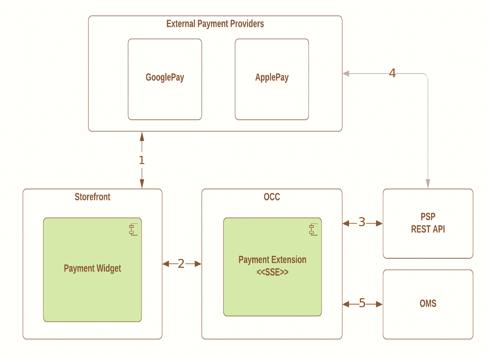

# Introduction <!-- omit in toc -->

1. [Supported Features](#supported-features)
2. [Payment Integration Architecture](#payment-integration-architecture)
3. [Components Interaction Flow](#components-interaction-flow)

The custom payment plugin solution provides an integration layer between OCC and the payment provider API. Implementation is based on payment  integration framework supported by OCC platform.

## Supported Features

1. Credit Card Payments
    - Supported gateway operations
        - Authorization / Sale
        - Void (Authorization Reversal)
        - Capture
        - Refund
    - Tokenized card payment based on Microform v2
    - Payer authentication support (3D Secure)
    - Network Tokens
    - Store tokenized credit/debit card against user profile
        - Payments using stored credit cards
2. Online Authorizations
    - Supported services
        - Google Pay
        - Apple Pay
    - Supported gateway operations
        - Authorization
        - Void (Authorization Reversal)
        - Capture
        - Refund
3. Decision Manager and Reporting
    - Fraud detection at the time of authorization
    - Managing Review decisions
        - API for Daily and On-Demand reports with Review decisions statuses

## Payment Integration Architecture

Integration with payment gateway consist of the following components and deliverables:

- Payment widget
- Payment gateway settings
- Custom payment integration service using Server Side Extensions

All the components listed above are part of the same package.

Please find bellow deliverables highlighted in green:

 Please notice Webhooks and Payment settings should be configured in OCC before using payment widgets.

[Generic Payment Gateway Integration](https://docs.oracle.com/en/cloud/saas/commerce-cloud/occ-developer/create-generic-payment-gateway-integration1.html) is used as an integration method with OCC

You can learn more about [Generic Webhook REST API](https://docs.oracle.com/en/cloud/saas/commerce-cloud/20a/cxocc/op-ccadmin-v1-webhook-genericpayment-post.html) contract to understand request/response payloads handled by SSE

Please find out more details about generic payments in the [Developing Generic Payment Gateways with Commerce Cloud](https://community.oracle.com/docs/DOC-1000845) document

## Components Interaction Flow

1.	Payment Widget can delegate payment to external payment providers
    - A shopper can be redirected to external provider to complete payment
    - A shopper can stay on the same page (In-Context checkout)
2.	Custom Payment Widget communicates with Payment Service (SSE)
    - OCC sends payment operation through the means of Webhooks (API Functions)
    - Payment Widget can consume public URLs (services) exposed by SSE
3.	Payment Extension consumes Payment Provider REST APIs using SDK client library
4.	Payment Provider communicates with external providers to fulfill its services
5.	OMS system controls certain steps in payment flow
    - Settlement can be triggered when goods are ready for shipment
    - Refund can be triggered when goods are delivered
    - For any technical glitch if order is rejected, SSE triggers auto cancel service(Auth Reversal)
    - Handling Fraud Payment and manual transaction reviews 
