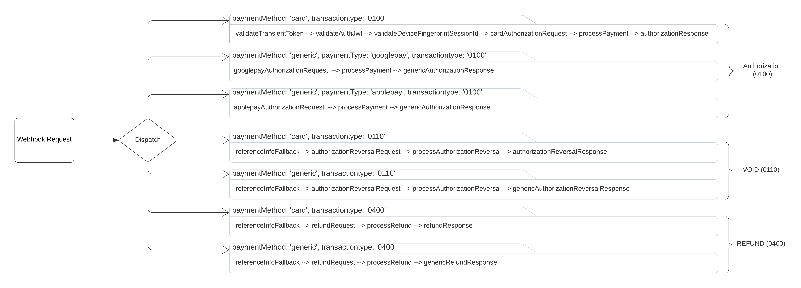

# Package Contents <!-- omit in toc -->

1. [OCC CLI Utilities](#occ-cli-utilities)
2. [Payment Gateway Package (payment-gateway)](#payment-gateway-package-payment-gateway)
3. [Server Extension Package (server-extension)](#server-extension-package-server-extension)
   1. [Authorizing access to endpoints](#authorizing-access-to-endpoints)
   2. [Request processing components](#request-processing-components)
   3. [Payment Dispatcher](#payment-dispatcher)
   4. [Build process](#build-process)
4. [Payment Widget Package (payment-widget)](#payment-widget-package-payment-widget)

## OCC CLI Utilities

In order to help with managing deployments to OCC of both widgets and SSE payment plugin includes CLI commands to help with automating the process.

The CLI tool is a combined version of utilities shared in the following community resources:

- [Node.js Server-Side Extension CLI](https://community.oracle.com/docs/DOC-1038506)
- [Node.js CLI for Managing Storefront Extensions](https://community.oracle.com/groups/oracle-commerce-cloud-group/blog/2020/05/04/nodejs-cli-for-managing-storefront-extensions)

By running `yarn occ` you will get the list of supported commands

```bash
yarn run v1.22.4
$ node ./bin/index.js
Usage: index [options] [command]

Options:
  -h, --help                                            display help for command

Commands:
  list-apps [options]                                   List server-side extension custom apps on CX Commerce server
  package-app <appName>                                 Create server-side extension archive
  upload-app [options] <appName>                        Upload server-side extension custom app to CX Commerce server
  server-log [options]                                  Get server-side extension logs
  tail-log [options]                                    Tail server-side extension logs
  download-app [options] <appName>                      Download server-side custom app files
  list-routes [options] [appName]                       List custom app routes
  config:list [options]                                 List environment variables
  config:set [options] <envVar> [otherEnvVars...]       Set environment variables
  config:unset [options] <envVar> [otherEnvVars...]     Set environment variables
  run-tests [options] <appName>                         Run tests
  upload-apple-domain-association [options] <filePath>  Upload Apple Pay domain association file
  settings:list [options] <gatewayId>                   Get Custom Site Settings. Get site settings by ID.
  settings:set [options] <gatewayId> <payload>          Update a Site Settings based on ID and request parameters.
  help [command]                                        display help for command
```

Please familiarize yourself with available command options by looking at `bin/sse/commands.js` scripts

## Payment Gateway Package (payment-gateway)

The `payment-gateway` package hold gateway settings definition according to [Supported payment methods and transaction types](https://docs.oracle.com/en/cloud/saas/cx-commerce/20c/ccdev/supported-payment-methods-and-transaction-types.html). It has the following contents:

```text
.
├── ext.json
├── gateway
│   └── isv-occ-gateway 
│       ├── config
│       │   ├── config.json // configuration properties
│       │   └── locales
│       └── gateway.json // supported payment methods and transaction types
├── package.json
└── settings.json // sample gateway settings used in local development and integration testing
```

The `gateway/isv-occ-gateway/gateway.json` file has the following definition:

```json
{
  "provider": "Cybersource Official",
  "paymentMethodTypes": ["generic", "card"],
  "transactionTypes": {
    "generic": ["initiate", "retrieve", "authorization", "void", "refund"],
    "card": ["authorization", "void", "refund"]
  },
  "processors" : {
    "card": "card3ds"
  }
}
```

Configuration above enables support for card payments as well as generic payments.

 `settings.json` should be configured with particular values in order to be able to proceed with local development and testing.

 Adding `processors.card` section makes sure [Generic Webhook](https://docs.oracle.com/en/cloud/saas/commerce-cloud/20a/cxocc/op-ccadmin-v1-webhook-genericpayment-post.html) will be triggered for both `card` and `generic` payment methods

The following settings can be configured in gateway:

| **Setting**                         | **Description**                                                                                                                                                                                                                                                                                                   |
|-------------------------------------|-------------------------------------------------------------------------------------------------------------------------------------------------------------------------------------------------------------------------------------------------------------------------------------------------------------------|
| **Common**                          |                                                                                                                                                                                                                                                                                                                   |
| **paymentMethodTypes**              | Enabled Payment Methods. Most of the time should both options                                                                                                                                                                                                                                                     |
| **paymentOptions**                  | Payment options enabled for payment using Payment Widget                                                                                                                                                                                                                                                          |
| **merchantID**                      | Merchant ID                                                                                                                                                                                                                                                                                                       |
| **merchantKeyId**                   | Merchant Key ID                                                                                                                                                                                                                                                                                                   |
| **merchantsecretKey**               | Merchant Secret Key                                                                                                                                                                                                                                                                                               |
| **authenticationType**              | Authentication Type                                                                                                                                                                                                                                                                                               |
| **messageEncryptionEnabled**        | Enable Message Level Encryption Type                                                                                                                                                                                                                                                                                               |
| **keyAlias**                        | Key Alias (in case authentication type = jwt)                                                                                                                                                                                                                                                                     |
| **keyPass**                         | Key Store Password (in case authentication type = jwt)                                                                                                                                                                                                                                                                      |
| **keyFileName**                     | Key File Name (in case authentication type = jwt)                                                                                                                                                                                                                                                                 |
| **runEnvironment**                  | PSP REST API environment to send requests to                                                                                                                                                                                                                                                                      |
| **saleEnabled**                     | Indicates if authorizing and taking payment will be done at the same time for a particular payment mode                                                                                                                                                                                                           |
|                                     |                                                                                                                                                                                                                                                                                                                   |
| **Credit Card**                     |                                                                                                                                                                                                                                                                                                                   |
| **payerAuthEnabled**                | Enables payer authentication for credit cards                                                                                                                                                                                                                                                                     |
| **scaEnabled**                | If enabled card holder will be 3DS Challenged when saving a card                                                                                                                                                                                                                                                                      |
| **networkTokenUpdates**                | Subscribe to Network Token Life cycle updates                                                                                                                                                                                                                                                                      |
| **microformSdkUrl**                      | Credit Card Microform SDK URL                                                                                                                                                                                                                                                                                          |
| **isCVVRequiredForSavedCards**      | Is the CVV required when using a saved card.                                                                                                                                                                                                                                                                      |
| **isCVVRequiredForScheduledOrders** | Is the CVV required for a Scheduled Order                                                                                                                                                                                                                                                                         |
|                                     |                                                                                                                                                                                                                                                                                                                   |
| **GooglePay**                       |                                                                                                                                                                                                                                                                                                                   |
| **googlePaySdkUrl**                 | GooglePay SDK URL                                                                                                                                                                                                                                                                                                 |
| **googlePayEnvironment**            | GooglePay environment                                                                                                                                                                                                                                                                                             |
| **googlePayGateway**                | To retrieve payment and customer information from a payment gateway that's supported by the Google Pay API. Gateway's identifier, which is issued by Google                                                                                                                                                       |
| **googlePayGatewayMerchantId**      | To retrieve payment and customer information from a payment gateway that's supported by the Google Pay API. Your gateway account ID, which is provided by the gateway                                                                                                                                             |
| **googlePayMerchantId**             | A Google merchant identifier issued after registration with the Google Pay Business Console. Required when PaymentsClient is initialized with an environment property of PRODUCTION. See Request production access for more information about the approval process and how to obtain a Google merchant identifier |
| **googlePayMerchantName**           | Merchant name encoded as UTF-8. Merchant name is rendered in the payment sheet. In TEST environment, or if a merchant isn't recognized, a “Pay Unverified Merchant” message is displayed in the payment sheet                                                                                                     |
| **googlePaySupportedNetworks**      | GooglePay Supported networks                                                                                                                                                                                                                                                                                      |
|                                     |                                                                                                                                                                                                                                                                                                                   |
| **ApplePay**                        |                                                                                                                                                                                                                                                                                                                   |
| **applePayMerchantId**              | ApplePay Merchant ID                                                                                                                                                                                                                                                                                              |
| **applePayInitiative**              | A predefined value that identifies the e-commerce application making the request. For ApplePay on the web use 'web'                                                                                                                                                                                               |
| **applePayInitiativeContext**       | Fully qualified domain name associated with your Apple Pay Merchant Identity Certificate                                                                                                                                                                                                                          |
| **applePaySupportedNetworks**       | ApplePay Supported Networks                                                                                                                                                                                                                                                                                       |
| **applePayDisplayName**    | Apple Pay display name |
|                                     |                                                                                                                                                                                                                                                                                                                   |
| **Decision Manager**                |                                                                                                                                                                                                                                                                                                                   |
| **dmDecisionSkip**                  | Indicates which payment modes should skip the decision manager step                                                                                                                                                                                                                                               |
| **deviceFingerprintEnabled**        | Enable Device Fingerprint                                                                                                                                                                                                                                                                                         |
| **deviceFingerprintUrl**            | Device Fingerprint URL                                                                                                                                                                                                                                                                                            |
| **deviceFingerprintOrgId**          | Device Fingerprint Organization ID                                                                                                                                                                                                                                                                                |
|                                     |                                                                                                                                                                                                                                                                                                                   |
| **Reporting**                       |                                                                                                                                                                                                                                                                                                                   |
| **dailyReportName**                 | Daily Report Name                                                                                                                                                                                                                                                                                                 |


  `isCVVRequiredForSavedCards` and `isCVVRequiredForScheduledOrders` should be present in gateway settings in order for saved cards to be working

Use Enable Message-Level Encryption Type in order for personally identifiable information, such as payment information, to be returned unmasked by TMS. If the Enable Message Level Encryption is set to 'Yes' you should have the authentication type as JWT.

Please refer to the [Authentication](https://developer.cybersource.com/api/developer-guides/dita-gettingstarted/authentication.html) documentation to learn more about available authentication types.In case authentication type is JWT you should place `p12` key file in `packages/server-extension/certs` directory, the `keyFileName` setting should be equal to the file name without 'p12' extension. `keyAlias` and `keyPass` should be updated accordingly (usually same value as MID).

## Server Extension Package (server-extension)

According to the list of supported features the [Generic Payment Gateway Integration](https://docs.oracle.com/en/cloud/saas/commerce-cloud/occ-developer/create-generic-payment-gateway-integration1.html) becomes the most suitable implementation method.

SSE provides an option to develop custom logic without need to deploy the service in an external environment or infrastructure. SSE facilitates communications between OCC and the payment service provider. The payment integration service performs the following functions:

- Integrates with the payment service provider using [client SDK](https://github.com/CyberSource/cybersource-rest-client-node)
- Authentication to the payment service provider
- Translation of OCC payment webhook requests to the format required by the payment provider.
- Translation of the payment provider response into the format required by OCC payment webhook.
- Integration of payment fraud detection services (Decision Manager)
- Additional APIs exposed for OMS systems
- Integration of custom business logic

The payment gateway integration service introduces dependency to PSP REST SDK client which facilitates all operations with the underlying PSP REST API. It handles authentication concerns and merchant configuration for the API client. Below is the list external resources which document the REST API being consumed

- [API Reference](https://developer.cybersource.com/api-reference-assets/index.html#payments)
- [Supported authentication mechanisms](https://developer.cybersource.com/api/developer-guides/dita-payments/authentication.html)

Find below the structure of the package:

```text
server-extension
 ┣ certs
 ┃ ┣ applePayIdentityCert.pem
 ┃ ┣ applePayIdentityKey.key
 ┃ ┗ isv_occ_test.p12
 ┣ config
 ┃ ┣ app.local.json
 ┃ ┗ app.prod.json
 ┣ docs
 ┃ ┗ isv-occ-payment.postman_collection.json
 ┣ locales
 ┃ ┗ Resources_en.properties
 ┣ src
 ┃ ┣ common
 ┃ ┃ ┣ genericDispatcher.ts
 ┃ ┃ ┗ index.ts
 ┃ ┣ controllers
 ┃ ┃ ┣ validation
 ┃ ┃ ┃ ┣ applePaySchema.ts
 ┃ ┃ ┃ ┣ capturePaymentSchema.ts
 ┃ ┃ ┃ ┣ checkSchema.ts
 ┃ ┃ ┃ ┣ common.ts
 ┃ ┃ ┃ ┣ flexCaptureContextSchema.ts
 ┃ ┃ ┃ ┣ refundPaymentSchema.ts
 ┃ ┃ ┃ ┗ reportSchema.ts
 ┃ ┃ ┣ applePay.ts
 ┃ ┃ ┣ flex.ts
 ┃ ┃ ┣ index.ts
 ┃ ┃ ┣ payerAuth.ts
 ┃ ┃ ┣ paymentCapture.ts
 ┃ ┃ ┣ paymentMethods.ts
 ┃ ┃ ┣ paymentRefund.ts
 ┃ ┃ ┣ paymentRouter.js
 ┃ ┃ ┣ payments.ts
 ┃ ┃ ┣ report.ts
 ┃ ┃ ┗ webhookRouter.ts
 ┃ ┣ errors
 ┃ ┃ ┣ handlers
 ┃ ┃ ┃ ┣ api400ResponseHandler.ts
 ┃ ┃ ┃ ┣ apiErrorResponseHandler.ts
 ┃ ┃ ┃ ┣ common.ts
 ┃ ┃ ┃ ┣ defaultErrorHandler.ts
 ┃ ┃ ┃ ┣ errorHandler.js
 ┃ ┃ ┃ ┣ index.ts
 ┃ ┃ ┃ ┗ requestValidationErrorHandler.ts
 ┃ ┃ ┣ apiExecutionError.ts
 ┃ ┃ ┣ baseError.ts
 ┃ ┃ ┣ index.ts
 ┃ ┃ ┗ requestValidationError.ts
 ┃ ┣ middlewares
 ┃ ┃ ┣ contextLoader.ts
 ┃ ┃ ┣ errorHandler.ts
 ┃ ┃ ┣ gatewaySettings.ts
 ┃ ┃ ┣ logger.ts
 ┃ ┃ ┣ merchantConfig.ts
 ┃ ┃ ┗ validateWebhook.ts
 ┃ ┣ services
 ┃ ┃ ┣ occ
 ┃ ┃ ┃ ┣ occClient.ts
 ┃ ┃ ┃ ┣ occClientStorefront.ts
 ┃ ┃ ┃ ┗ webhookSignatureValidation.ts
 ┃ ┃ ┣ payments
 ┃ ┃ ┃ ┣ api
 ┃ ┃ ┃ ┃ ┣ generateKey.ts
 ┃ ┃ ┃ ┃ ┣ paymentCommand.ts
 ┃ ┃ ┃ ┃ ┣ processAuthorizationReversal.ts
 ┃ ┃ ┃ ┃ ┣ processAutoAuthorizationReversal.ts
 ┃ ┃ ┃ ┃ ┣ processCapture.ts
 ┃ ┃ ┃ ┃ ┣ processPayment.ts
 ┃ ┃ ┃ ┃ ┣ processRefund.ts
 ┃ ┃ ┃ ┃ ┗ processWebhookSubscription.ts
 ┃ ┃ ┃ ┣ converters
 ┃ ┃ ┃ ┃ ┣ request
 ┃ ┃ ┃ ┃ ┃ ┣ mappers
 ┃ ┃ ┃ ┃ ┃ ┃ ┣ additionalFieldsMapper.ts
 ┃ ┃ ┃ ┃ ┃ ┃ ┣ billingAddressMapper.ts
 ┃ ┃ ┃ ┃ ┃ ┃ ┣ buyerRiskInformationMapper.ts
 ┃ ┃ ┃ ┃ ┃ ┃ ┣ cardSelectionIndicatorMapper.ts
 ┃ ┃ ┃ ┃ ┃ ┃ ┣ decisionManagerMapper.ts
 ┃ ┃ ┃ ┃ ┃ ┃ ┣ deviceFingerprintMapper.ts
 ┃ ┃ ┃ ┃ ┃ ┃ ┣ genericLineItemsMapper.ts
 ┃ ┃ ┃ ┃ ┃ ┃ ┣ index.ts
 ┃ ┃ ┃ ┃ ┃ ┃ ┣ partnerMapper.ts
 ┃ ┃ ┃ ┃ ┃ ┃ ┣ payerAuthEnrollMapper.ts
 ┃ ┃ ┃ ┃ ┃ ┃ ┣ payerAuthValidationMapper.ts
 ┃ ┃ ┃ ┃ ┃ ┃ ┣ plainCardPaymentMapper.ts
 ┃ ┃ ┃ ┃ ┃ ┃ ┣ saleMapper.ts
 ┃ ┃ ┃ ┃ ┃ ┃ ┣ savedCardPaymentMapper.ts
 ┃ ┃ ┃ ┃ ┃ ┃ ┣ savePaymentTokenMapper.ts
 ┃ ┃ ┃ ┃ ┃ ┃ ┣ shippingAddressMapper.ts
 ┃ ┃ ┃ ┃ ┃ ┃ ┣ lineItemAndsubTotalMapper.ts
 ┃ ┃ ┃ ┃ ┃ ┃ ┗ transientTokenInfoMapper.ts
 ┃ ┃ ┃ ┃ ┃ ┣ applepayAuthorization.ts
 ┃ ┃ ┃ ┃ ┃ ┣ authorizationReversal.ts
 ┃ ┃ ┃ ┃ ┃ ┣ capture.ts
 ┃ ┃ ┃ ┃ ┃ ┣ captureEndpoint.ts
 ┃ ┃ ┃ ┃ ┃ ┣ cardAuthorization.ts
 ┃ ┃ ┃ ┃ ┃ ┣ common.ts
 ┃ ┃ ┃ ┃ ┃ ┣ googlepayAuthorization.ts
 ┃ ┃ ┃ ┃ ┃ ┣ index.ts
 ┃ ┃ ┃ ┃ ┃ ┣ referenceInfoFallback.ts
 ┃ ┃ ┃ ┃ ┃ ┣ refund.ts
 ┃ ┃ ┃ ┃ ┃ ┗ refundEndpoint.ts
 ┃ ┃ ┃ ┃ ┣ response
 ┃ ┃ ┃ ┃ ┃ ┣ card
 ┃ ┃ ┃ ┃ ┃ ┃ ┣ authorization.ts
 ┃ ┃ ┃ ┃ ┃ ┃ ┣ authorizationReversal.ts
 ┃ ┃ ┃ ┃ ┃ ┃ ┣ capture.ts
 ┃ ┃ ┃ ┃ ┃ ┃ ┗ refund.ts
 ┃ ┃ ┃ ┃ ┃ ┣ common
 ┃ ┃ ┃ ┃ ┃ ┃ ┣ customProperties.ts
 ┃ ┃ ┃ ┃ ┃ ┃ ┣ genericCardPayment.ts
 ┃ ┃ ┃ ┃ ┃ ┃ ┗ genericPayment.ts
 ┃ ┃ ┃ ┃ ┃ ┣ errors
 ┃ ┃ ┃ ┃ ┃ ┃ ┣ apiCardError.ts
 ┃ ┃ ┃ ┃ ┃ ┃ ┗ apiGenericError.ts
 ┃ ┃ ┃ ┃ ┃ ┣ generic
 ┃ ┃ ┃ ┃ ┃ ┃ ┣ authorizationReversal.ts
 ┃ ┃ ┃ ┃ ┃ ┃ ┣ capture.ts
 ┃ ┃ ┃ ┃ ┃ ┃ ┣ genericAuthorization.ts
 ┃ ┃ ┃ ┃ ┃ ┃ ┗ refund.ts
 ┃ ┃ ┃ ┃ ┃ ┣ mappers
 ┃ ┃ ┃ ┃ ┃ ┃ ┣ index.ts
 ┃ ┃ ┃ ┃ ┃ ┃ ┣ payerAuthMapper.ts
 ┃ ┃ ┃ ┃ ┃ ┃ ┣ scaMapper.ts
 ┃ ┃ ┃ ┃ ┃ ┃ ┣ saleCardMapper.ts
 ┃ ┃ ┃ ┃ ┃ ┃ ┣ saleGenericMapper.ts
 ┃ ┃ ┃ ┃ ┃ ┃ ┗ savedCardPaymentMapper.ts
 ┃ ┃ ┃ ┃ ┃ ┣ reports
 ┃ ┃ ┃ ┃ ┃ ┃ ┣ index.ts
 ┃ ┃ ┃ ┃ ┃ ┃ ┣ reportDaily.ts
 ┃ ┃ ┃ ┃ ┃ ┃ ┗ reportOnDemand.ts
 ┃ ┃ ┃ ┃ ┃ ┣ captureEndpoint.ts
 ┃ ┃ ┃ ┃ ┃ ┣ common.ts
 ┃ ┃ ┃ ┃ ┃ ┣ index.ts
 ┃ ┃ ┃ ┃ ┃ ┣ refundEndpoint.ts
 ┃ ┃ ┃ ┃ ┃ ┗ subscribeApi.js
 ┃ ┃ ┃ ┃ ┗ common.ts
 ┃ ┃ ┃ ┣ paymentMethod
 ┃ ┃ ┃ ┃ ┣ configBuilder.ts
 ┃ ┃ ┃ ┃ ┗ paymentMethodService.ts
 ┃ ┃ ┃ ┣ reports
 ┃ ┃ ┃ ┃ ┣ dailyReport.ts
 ┃ ┃ ┃ ┃ ┣ index.ts
 ┃ ┃ ┃ ┃ ┣ intervalService.ts
 ┃ ┃ ┃ ┃ ┗ onDemandReport.ts
 ┃ ┃ ┃ ┣ validators
 ┃ ┃ ┃ ┃ ┣ deviceFingerprintSessionIdValidator.ts
 ┃ ┃ ┃ ┃ ┗ transientTokenValidator.ts
 ┃ ┃ ┃ ┣ applePayService.ts
 ┃ ┃ ┃ ┣ autoAuthReversalService.ts
 ┃ ┃ ┃ ┣ deviceFingerprintService.ts
 ┃ ┃ ┃ ┣ flexService.ts
 ┃ ┃ ┃ ┣ payerAuthSetupService.ts
 ┃ ┃ ┃ ┣ paymentCaptureService.ts
 ┃ ┃ ┃ ┣ paymentContextBuilder.ts
 ┃ ┃ ┃ ┣ paymentDispatcher.ts
 ┃ ┃ ┃ ┗ paymentRefundService.ts
 ┃ ┃ ┣ cacheService.ts
 ┃ ┃ ┣ cryptoService.ts
 ┃ ┃ ┣ jwtService.ts
 ┃ ┃ ┣ loggingService.ts
 ┃ ┃ ┗ publicKeyApi.js
 ┃ ┣ types
 ┃ ┃ ┗ occ-sdk.d.ts
 ┃ ┣ app.ts
 ┃ ┣ indexServerExtension.ts
 ┃ ┗ server.ts
 ┣ jest.config.js
 ┣ jest.int.config.js
 ┣ jest.unit.config.js
 ┣ nodemon.json
 ┣ package.json
 ┗ tsconfig.json
```

 Please notice a Postman collection (`docs/isv-occ-payment.postman_collection.json`) is included into SSE package which can be used for testing and exploring the following API endpoints:

| **Endpoint**                                            | **Description**                                                                                                                 |
|---------------------------------------------------------|---------------------------------------------------------------------------------------------------------------------------------|
| `/ccstorex/custom/isv-payment/v2/paymentMethods`        | Returns list of supported payment types. Consumer: Payment Widget                                                               |
| `/ccstorex/custom/isv-payment/v2/keys`                  | Generates Microform public key (capture context). Consumer: Payment Widget                                                           |
| `/ccstorex/custom/isv-payment/v2/payments`              | Generic Payments Webhook handler endpoint.  Consumer: Payment Widget                                                                |
| `/ccstorex/custom/isv-payment/v2/applepay/validate`     | Validates ApplePay session. Consumer: Payment Widget                                                                            |
| `/ccstorex/custom/isv-payment/v2/report/daily`          | Returns daily conversion report for a given date. Consumer: Fulfillment                                                         |
| `/ccstorex/custom/isv-payment/v2/report/onDemand`       | Returns conversion report for specified start and end dates. Applies only for less than 24 hour interval. Consumer: Fulfillment |
| `/ccstorex/custom/isv-payment/v2/capture`               | Capture funds for a given transaction. Consumer: Fulfillment                                                                    |
| `/ccstorex/custom/isv-payment/v2/refund`                | Refund payment for a given transaction. Consumer: Fulfillment                                                                   |

### Authorizing access to endpoints

Those endpoints which will be consumed by Fulfillment might need be secured so that only authorized calls come through. OCCS provides a custom 'authenticatedUrls' property which describes the routes that a user must be logged in to access

In order to add url to 'authenticatedUrls' property in package.json use the following syntax:

```json
  "authenticatedUrls": [
    {
      "url": "/ccstorex/custom/isv-payment/v2/capture",
      "method": [
        "post"
      ]
    },
    {
      "url": "/ccstorex/custom/isv-payment/v2/refund",
      "method": [
        "post"
      ]
    },
    {
      "url": "/ccstorex/custom/isv-payment/v2/report/daily",
      "method": [
        "get"
      ]
    },
    {
      "url": "/ccstorex/custom/isv-payment/v2/report/onDemand",
      "method": [
        "get"
      ]
    }
  ],
```

### Request processing components

Each request reaching out SSE endpoints goes through a set of processing components. Please follow the request processing path in the diagram below:


- Each request first goes through a list of common ExpressJS middleware
- Controllers represent API entry points
- Service Logic handles all business logic
- Communication with PSP is handled by SDK client library

The table below lists available middleware components

| **Middleware**     | **Description**                                                             |
|--------------------|-----------------------------------------------------------------------------|
| `contextLoader`    | Initializes service layer logic                                             |
| `loggerMiddleware` | Can be used to log incoming HTTP request details                            |
| `validateWebhook`  | Validates Webhook signature                                                 |
| `gatewaySettings`  | Request gateway settings from OCC and cache it for a configurable TTL value |
| `merchantConfig`   | Creates merchant configuration for SDK client                               |
| `allRoutes`        | Registers all endpoints (routes)                                            |
| `errorMiddleware`  | Centralized error handling                                                  |

Additional configuration properties managed by 'nconf' library available in OCC environment are located at `packages/server-extension/config`. Please notice there are version for local and production (deployed) environments

SSE communicates with PSP using client [NodeJS SDK v0.0.43](https://github.com/CyberSource/cybersource-rest-client-node). Typescript friendly SDK wrapper is located in the `packages/payment-sdk`. It declares TS type definition's for the PSP API. You can manage generated type definitions by tweaking `packages/payment-sdk/generator/cybersource-ts-template/api.mustache` template. In order to generate new types from the updated template run the following:

```bash
cd packages/payment-sdk
yarn generate
```

 You will need to re-generate new type definitions for the PSP SDK once you upgrade to the new client SDK version. please follow new release updates in the [Official repository](https://github.com/CyberSource/cybersource-rest-client-node/releases)

OCC endpoints are consumed using OCC provided SDK library. TS wrapper for the SDK is available in a separate package `packages/occ-sdk`.

### Payment Dispatcher

The entry point for Webhook payments logic is defined in `packages/server-extension/src/services/payments/index.ts`. Webhook request is dispatched to a specific chain of request handlers based on transaction type and payment method type. Please see below conceptual diagram which depicts how Webhook request is being dispatched to a particular chain of responsibility:



### Build process

Once `server-extension` is built using `yarn build:prod` command it is ready for deployment to OCC.

Code is being compiled by Typescript into NodeJS (CJS) module format and output is located at `packages/server-extension/cjs`.

## Payment Widget Package (payment-widget)

Payment provides UI implementation of the payment selector component for an user to be able to choose payment method from the list of supported methods.

The widget will integrate with OCC through the means of Generic Webhook with custom logic and flows being supported by custom payment properties delivered as part of the webhook payload.

Payment widget will render previously saved cards as an option to commit a payment.

Please refer to the documents below to familiarize yourself with Widget development:

- [Understand Widgets](https://docs.oracle.com/en/cloud/saas/cx-commerce/20c/widge/understand-widgets.html)
- [Developing a Custom Widget in Oracle Commerce Cloud](https://community.oracle.com/groups/oracle-commerce-cloud-group/blog/2019/04/24/developing-a-custom-widget-in-oracle-commerce-cloud)

The overall UI integration flow is as follows:

1. Payment Widget will be loaded with available Storefront checkout-payment page.
2. Before Widget appears a list of supported payment methods is fetched from the SSE (`/ccstorex/custom/isv-payment/v2/paymentMethods`)
3. Payment selector UI component renders the list of supported payment methods
4. User can chooses one of the methods and proceed with order placement by providing payment details
5. Order is submitted to OCC and Generic Webhook is called
6. SSE performs submitted operation based on transaction type and payment method
7. Webhook response is compiled with additional payment properties supplied in the response payload
8. Widget gets reply from Webhook and performs further actions based on the payload (e.g. display Payer Authentication screen)

Find below the structure of the package

```text
plugins
 ┣ actions
 ┃ ┣ apple-pay-validation-action
 ┃ ┃ ┣ index.js
 ┃ ┃ ┗ meta.js
 ┃ ┣ flex-microform-action
 ┃ ┃ ┣ index.js
 ┃ ┃ ┗ meta.js
 ┃ ┣ get-payer-auth-token-action
 ┃ ┃ ┣ index.js
 ┃ ┃ ┗ meta.js
 ┃ ┣ index.js
 ┃ ┗ meta.js
 ┣ components
 ┃ ┣ isv-checkout-continue-to-review-order-button
 ┃ ┃ ┣ index.jsx
 ┃ ┃ ┣ meta.js
 ┃ ┃ ┗ styles.css
 ┃ ┣ isv-checkout-place-order-button
 ┃ ┃ ┣ index.jsx
 ┃ ┃ ┣ meta.js
 ┃ ┃ ┗ styles.css
 ┃ ┣ isv-payment-method
 ┃ ┃ ┣ components
 ┃ ┃ ┃ ┣ isv-add-card-details
 ┃ ┃ ┃ ┃ ┗ index.jsx
 ┃ ┃ ┃ ┣ isv-applepay-payment-method
 ┃ ┃ ┃ ┃ ┣ applePay.css
 ┃ ┃ ┃ ┃ ┣ applePay.js
 ┃ ┃ ┃ ┃ ┗ index.jsx
 ┃ ┃ ┃ ┣ isv-checkout-card-details
 ┃ ┃ ┃ ┃ ┗ index.jsx
 ┃ ┃ ┃ ┣ isv-checkout-saved-card-item
 ┃ ┃ ┃ ┃ ┗ index.jsx
 ┃ ┃ ┃ ┣ isv-checkout-saved-cards
 ┃ ┃ ┃ ┃ ┗ index.jsx
 ┃ ┃ ┃ ┣ isv-credit-card-payment-method
 ┃ ┃ ┃ ┃ ┣ index.jsx
 ┃ ┃ ┃ ┃ ┗ IsvCreditCard.jsx
 ┃ ┃ ┃ ┗ isv-googlepay-payment-method
 ┃ ┃ ┃ ┃ ┣ googlepay.css
 ┃ ┃ ┃ ┃ ┣ googlePay.js
 ┃ ┃ ┃ ┃ ┗ index.jsx
 ┃ ┃ ┣ isv-payment-utility
 ┃ ┃ ┃ ┣ common.js
 ┃ ┃ ┃ ┣ flex-microform-api.js
 ┃ ┃ ┃ ┣ flex-microform.js
 ┃ ┃ ┃ ┗ script-loader.js
 ┃ ┃ ┣ styles
 ┃ ┃ ┃ ┗ flex.css
 ┃ ┃ ┣ index.jsx
 ┃ ┃ ┣ meta.js
 ┃ ┃ ┗ styles.css
 ┃ ┣ index.js
 ┃ ┗ meta.js
 ┣ endpoints
 ┃ ┣ apple-pay-validation-endpoint
 ┃ ┃ ┣ index.js
 ┃ ┃ ┗ meta.js
 ┃ ┣ flex-microform-endpoint
 ┃ ┃ ┣ index.js
 ┃ ┃ ┗ meta.js
 ┃ ┣ payer-auth-endpoint
 ┃ ┃ ┣ index.js
 ┃ ┃ ┗ meta.js
 ┃ ┣ payment-method-config-endpoint
 ┃ ┃ ┣ index.js
 ┃ ┃ ┗ meta.js
 ┃ ┣ index.js
 ┃ ┗ meta.js
 ┣ fetchers
 ┃ ┣ flex-microform-fetcher
 ┃ ┃ ┣ hook.js
 ┃ ┃ ┣ index.js
 ┃ ┃ ┗ meta.js
 ┃ ┣ payment-method-config-fetcher
 ┃ ┃ ┣ hook.js
 ┃ ┃ ┣ index.js
 ┃ ┃ ┗ meta.js
 ┃ ┣ hooks.js
 ┃ ┣ index.js
 ┃ ┗ meta.js
 ┣ selectors
 ┃ ┣ flex-microform-selector
 ┃ ┃ ┗ index.js
 ┃ ┣ payment-method-config-selector
 ┃ ┃ ┗ index.js
 ┃ ┗ index.js
 ┗ subscribers
   ┣ index.js
   ┗ meta.js
```


The overall payment components interaction flow withing checkout process is presented below:


1. Shopper clicks 'Place  Order' button
2. 'initiate' payment action is triggered with current selected payment method
3. Payment action is routed to the appropriate component which listens to the initiate action
4. Payment component collects payment details (might be in asynchronous way)
5. Checkout process waits until payment details are available and then updates payment context array accordingly. Order is submitted
6. Payment is finalized on successful submission

The flow documented above applies to all payment components

