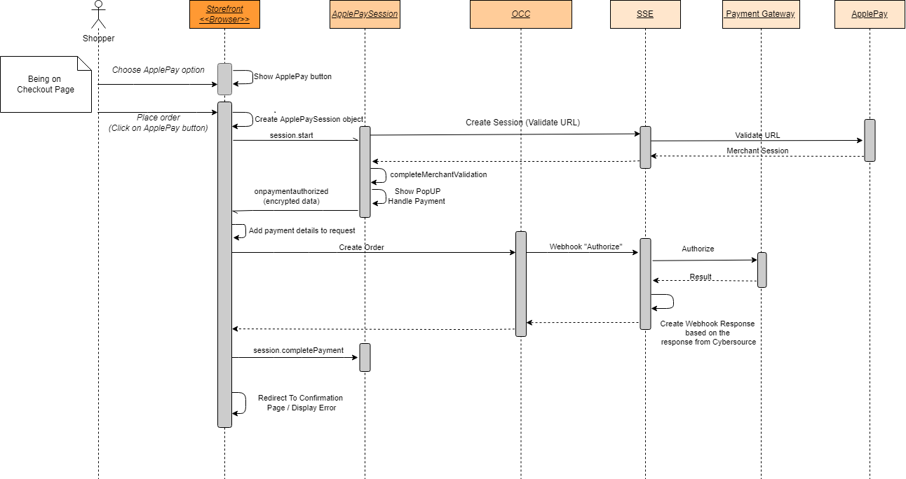

# ApplePay <!-- omit in toc -->

1. [Description](#description)
2. [Implementation Details](#implementation-details)
   1. [Configuration](#configuration)
   2. [Setup ApplePay](#setup-applepay)
   3. [Payment Steps](#payment-steps)
   4. [UI integration details](#ui-integration-details)
   5. [Backend (SSE) integration details](#backend-sse-integration-details)

## Description

Apple Pay is a mobile payment and digital wallet service by Apple Inc. that allows users to make payments in person, in iOS apps, and on the web. It is supported on the iPhone, Apple Watch, iPad and Mac.

The following documentation should be considered:

- [REST API development guide](https://developer.cybersource.com/api/developer-guides/dita-payments/CreatingOnlineAuth/CreatingAuthReqApplePay.html)
- [Apple Pay on the Web](https://developer.apple.com/documentation/apple_pay_on_the_web)

Payments are only supported by Apple devices and Safari browsers. Safari browser already has an embedded Javascript support in order to start the payment flow (no need to include additional library). See more details about [ApplePaySession](https://developer.apple.com/documentation/apple_pay_on_the_web/applepaysession) for managing the payment process on the web.

ApplePay payment service includes the following payment operations:

- Authorization
- Authorization Reversal (VOID)
- Capture
- Refund

## Implementation Details

### Configuration

The following gateway settings apply to ApplePay payments

| **Setting**                   | **Description**                                                                                                     |
|-------------------------------|---------------------------------------------------------------------------------------------------------------------|
| **applePayMerchantId**        | ApplePay Merchant ID                                                                                                |
| **applePayInitiative**        | A predefined value that identifies the e-commerce application making the request. For ApplePay on the web use 'web' |
| **applePayInitiativeContext** | Fully qualified domain name associated with your Apple Pay Merchant Identity Certificate                            |
| **applePaySupportedNetworks** | ApplePay Supported Networks                                                                                         |
| **applePayDisplayName**    | Apple Pay display name |

Default values:

- `applePayInitiative`: 'web'
- `applePaySupportedNetworks`: 'visa,masterCard,amex,discover'. List of supported card networks. Can be updated in OCC Admin

### Setup ApplePay

You will need to go through the steps from the [Configure Apple Pay on the web](https://help.apple.com/developer-account/#/dev1731126fb) in order to setup ApplePay payments

1. Go to Business Centre -> Payment Configuration -> Digital Payment Solutions
2. Configure ApplePay by generating  certificate signing request (CSR) and providing Apple Merchant ID
3. `applePayMerchantId` gateway setting should get the value of the introduced Apple Merchant ID
4. Download CSR
5. Create merchant identify in your ApplePay dev account (as per docs)
6. Create Apple Pay Payment Processing Certificate for the identity you have just created (upload the certificate file downloaded from  Business Centre in previous step)
7. Create merchant identity certificate. This certificate is used on the Web when a session validation request is triggered.
8. Register merchant domain and verify it (https://help.apple.com/developer-account/#/dev1731126fb). Merchant domain is where an application is being deployed to.

The [Upload an Apple Pay merchant identity certificate](https://community.oracle.com/groups/oracle-commerce-cloud-group/blog/2019/06/20/how-to-upload-third-party-files) guide can be used in order to setup ApplePay for testing in the sandbox environment. `yarn occ` CLI tool has a command for your convenience which can upload domain association file for you:

```bash
yarn occ upload-apple-domain-association -u ${OCC_ADMIN_HOST} -k ${APPLICATION_KEY} <apple-developer-merchantid-domain-association>
```

where

- `APPLICATION_KEY` - Application Key created in Settings -> Web APIs ->  Registered Applications
- `OCC_ADMIN_HOST` - your OCC specific environment, e.g. `asbx80c1dev-admin-{env}.oraclecloud.com`
- `apple-developer-merchantid-domain-association` - domain association file downloaded from ApplePay dev account

When you verify domain make sure it is accessible from ApplePay network. OCC Storefront (e.g. `https://asbx80c1dev-admin-{env}.oraclecloud.com/thirdparty/.well-known/apple-developer-merchantid-domain-association`) is often protected by basic authentication which might fail the domain verification process. You can use [updateBasicAuthConfiguration](https://docs.oracle.com/en/cloud/saas/commerce-cloud/20a/cxocc/op-ccadmin-v1-merchant-basicauth-put.html) to update your storefront access control settings by removing basic authentication or whitelisting [ApplePay IP Range](https://developer.apple.com/documentation/apple_pay_on_the_web/setting_up_your_server)

 The Merchant Identity Certificate is used to validate ApplePay session in `packages/server-extension/src/services/payments/applePayService.ts`. Before deploying, place the certificate and private key files in the specified paths with exact file names as follows: 
- Identity Certificate : `packages/server-extension/certs/applePayIdentityCert.pem`
- Private Key : `packages/server-extension/certs/applePayIdentityKey.key` 

Please make sure you update gateway settings once you complete all setup steps:

- `applePayInitiativeContext` should be the verified domain (.e.g `asbx80c1dev-store-{env}.oraclecloud.com`)

 It is recommended to test ApplePay in OCC storefront, not preview mode to avoid confusion with domain being verified during payments (ApplePay will accept payments only from verified domains).

You will need to create [ApplePay Tester account](https://developer.apple.com/apple-pay/sandbox-testing/) to be able to test ApplePay before going to production

### Payment Steps

ApplePay payment flow is the following:

1. ApplePay payment option is rendered by the Payment Selector component
2. Shopper chooses to pay with ApplePay by clicking the button
3. ApplePay session object is created
4. Validate merchant request is sent to SEE in order to start an ApplePay session
5. Merchant session is returned back from SSE and merchant validation is completed by client side
6. ApplePay handles the payment and returns encrypted payment data as result
7. Generic payment is added to the list and encrypted payment blob is added to custom payment properties
8. OCC order creation endpoint is called
9. Generic "Authorize" Webhook is triggered with custom payment data
10. Payment is authorized by SSE and result is returned back to storefront
11. ApplePay session objects completes the payment with `ApplePaySession.STATUS_SUCCESS`



### UI integration details

ApplePay UI component is located in Payment Widget:

```text
plugins
 ├── actions
 | ├── apple-pay-validation-action
 | | ├── index.js
 | | └── meta.js
 | ├── index.js
 | └── meta.js
 ├── components
 | ├── isv-payment-method
 | | ├── components
 | | | ├── isv-applepay-payment-method
 | | | | ├── applePay.css
 | | | | ├── applePay.js
 | | | | └── index.jsx
 | | ├── isv-payment-utility
 | | | ├── common.js
 | | | └── script-loader.js
 | | ├── index.jsx
 | | ├── meta.js
 | | └── styles.css
 | ├── index.js
 | └── meta.js
 ├── endpoints
 | ├── apple-pay-validation-endpoint
 | | ├── index.js
 | | └── meta.js
 | ├── payment-method-config-endpoint
 | | ├── index.js
 | | └── meta.js
 | ├── index.js
 | └── meta.js
 ├── fetchers
 | ├── payment-method-config-fetcher
 | | ├── hook.js
 | | ├── index.js
 | | └── meta.js
 | ├── hooks.js
 | ├── index.js
 | └── meta.js
 └── selectors
   ├── payment-method-config-selector
   | └── index.js
   └── index.js
 ```

- Before Payment Widget is rendered available payment methods are retrieved from SSE `/ccstorex/custom/isv-payment/v2/paymentMethods` endpoint
- Implementation checks whether ApplePay is supported by calling `ApplePaySession.canMakePayments`
- ApplePay button is shown in case it is supported by shopper's device otherwise a message is displayed saying the payment method is not supported
- On clicking either ApplePay button or 'Place Order' button payment is initiated by creating payment request and showing payment sheet (pop-up window) to the shopper
- ApplePay session is validated for current domain by calling `/ccstorex/custom/isv-payment/v2/applepay/validate`
- Once session is validated shopper proceeds with payment method selection from the sheet and payment details are updated with encrypted payment token
- Payment token is used to authorize the payment

### Backend (SSE) integration details

List of related controllers:

- `server-extension/src/controllers/paymentMethods.ts` - returns supported payment method configurations
- `packages/server-extension/src/controllers/applePay.ts` - validates ApplePay session and returns session data

The list of handlers processing ApplePay Webhook requests in SSE can be found in `server-extension/src/services/payments/index.ts`

| **Operation**              | **Handlers**                           | **Description**                                                                                                  |
|----------------------------|----------------------------------------|------------------------------------------------------------------------------------------------------------------|
| **generic_applepay_0100**  | `applepayAuthorizationRequest`         | converts Webhook request into PSP payment request                                                                |
|                            | `processPayment`                       | sends payment request to PSP using client SDK                                                                    |
|                            | `genericAuthorizationResponse`         | converts PSP response into Webhook response                                                                      |
|                            |                                        |                                                                                                                  |
| **generic_0110**           | `referenceInfoFallback`                | in case authorization transaction id is not sent by OCC fallback to the one found in order data fetched from OCC |
|                            | `authorizationReversalRequest`         | converts Webhook request into reversal PSP request                                                               |
|                            | `processAuthorizationReversal`         | sends reversal request to PSP using client SDK                                                                   |
|                            | `genericAuthorizationReversalResponse` | converts PSP response into Webhook response                                                                      |
|                            |                                        |                                                                                                                  |
| **generic_0400**           | `referenceInfoFallback`                | in case authorization transaction id is not sent by OCC fallback to the one found in order data fetched from OCC |
|                            | `refundRequest`                        | converts Webhook request into refund PSP request                                                                 |
|                            | `processRefund`                        | sends refund request to PSP using client SDK                                                                     |
|                            | `genericAuthorizationReversalResponse` | converts PSP response into Webhook response                                                                      |