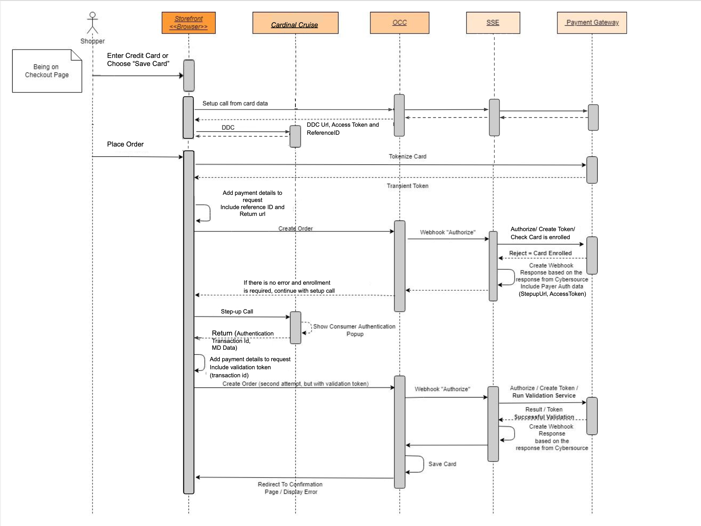

# Credit Card <!-- omit in toc -->

1. [Description](#description)
2. [Implementation Details](#implementation-details)
   1. [Configuration](#configuration)
   2. [Microform Card Payments](#microform-card-payments)
      1. [UI integration details](#ui-integration-details)
      2. [Backend (SSE) integration details](#backend-sse-integration-details)
   3. [Payer Authentication](#payer-authentication)
      1. [UI integration details](#ui-integration-details-1)
      2. [Backend (SSE) integration details](#backend-sse-integration-details-1)
      3. [Decision Manager with Payer Authentication](#decision-manager-with-payer-authentication)
      4. [Strong Customer Authentication (SCA)](#strong-customer-authentication-sca)
   4. [Network Tokens](#network-tokenization)
   5. [Capturing funds during authorization (SALE)](#capturing-funds-during-authorization-sale)

## Description

Credit card payment services allow to process payment cards from different brands through a single secure connection.

The Credit Card payment service provides the following operations:

- Authorization
- Authorization Reversal (VOID)
- Sale (Authorization + Settlement)
- Capture
- Refund

The following applies to credit card payments:

- Credit card payments using [Microform v2](https://developer.cybersource.com/api/developer-guides/dita-flex/SAFlexibleToken/FlexMicroform.html). The transient token represents both card number (PAN) and CVV. Only token, card expiration date and masked card number going to be sent in a webhook request.
- Payer Authentication (3D Secure)
- Shopper can choose to save credit/debit card as part of profile
- Subscribe to Network Token life cycle updates
- Shopper can pay with a saved card

  With Microform, the capture of card number and security code (CVV) are fully outsourced to the payment provider, which can qualify merchants for SAQ A-based assessments. Microform provides the most secure method for tokenizing card data. Sensitive data is encrypted on the customer's device before HTTPS transmission to the payment provider. This method mitigates any compromise of the HTTPS connection through a man in the middle attack.

## Implementation Details

### Configuration

The following gateway settings apply to credit card payments

| **Setting**                         | **Description**                                                                                   |
|-------------------------------------|---------------------------------------------------------------------------------------------------|
| **paymentMethodTypes**              | Enabled Payment Methods. 'Credit & Debit Card' should be enabled                                  |
| **paymentOptions**                  | Payment options enabled for payment using Payment Widget. 'Credit & Debit Card' should be enabled |
| **payerAuthEnabled**                | Enables payer authentication (3D Secure) for credit cards                                         |
| **scaEnabled**                      | If enabled card holder will be 3DS Challenged when saving a card                                  |
| **networkTokenUpdates**             | Subscribe to Network Token Life cycle updates                               |
| **saleEnabled**                     | Indicates if authorizing and taking payment will be done at the same time                         |
| **isCVVRequiredForSavedCards**      | Should be disabled as CVV is not required in backend                                              |
| **isCVVRequiredForScheduledOrders** | Should be disabled as CVV is not required in backend                                              |

Default values:

- `payerAuthEnabled`: true. Payer authentication is enabled by default
- `scaEnabled` : false
- `networkTokenUpdates` : false
- `isCVVRequiredForSavedCards`: false
- `isCVVRequiredForScheduledOrders`: false
- `saleEnabled` - by default SALE is disabled for Card payments. Can be enabled in OCC Admin

### Microform Card Payments

The following describes the end to end use case with an option to save credit/debit card:

1. Shopper chooses to checkout
2. Shopper enters card information
3. Credit/Debit card information is sent to payment provider client side and a one time (transient) use token is returned.
4. Save the one time client token and include the client token in the payment part of the order
5. Shopper chooses to save the card for later
6. Shopper places the order
7. Payment webhook is triggered with transaction type "0100" (authorize). The following properties sent in the request:
    - Transient token
    - Masked card number
    - Expiration date (This property must be sent because it must be saved)
    - Optional flag to save the card
8. Payment Provider response with an Approve decision and returns a multi-use token
9. OCC accepts the multi-use token and saves the card and associated properties (expiration date, masked card number if sent in request)
10. Shopper sees order confirmation and card is saved
11. Saved card should become visible in shopper's profile

**Note:** Saved Card feature is supported only during checkout


#### UI integration details

Below are credit card related components from Payment Widget:
`/packages/apps/core-commerce-reference-store/src/plugins/components/isv-payment-method/component/isv-creditcard-payment-method`

The application is structured based on OSF especifications.

Inside the components there is the list of widgets that are necessary to integrate the card payment using Cybersource.
Inside the endpoints folder there is specific call to REST apis
Fetchers are used to call APIs before the widget is redered. This are used to load data that widgets need before they can be rendered in the page. Fetchers can be global or local that means that some fetcher will be contained inside the components/widget folder (where widget is your custom widget).
Actions are used to call APIs but when the user performeces an action like clicking a button.

To read more about follow the next link.

Understand OSF applications [CX-Commerce](https://docs.oracle.com/en/cloud/saas/cx-commerce/22d/dosfa/understand-osf-applications.html)

REST API for Oracle Commerce Cloud 22D [Oracle Commerce Cloud](https://docs.oracle.com/en/cloud/saas/cx-commerce/22d/cxocc/op-ccadmin-v1-merchant-paymenttypes-get.html)

Microform Integration v2 Documentation [Microform v2](https://developer.cybersource.com/docs/cybs/en-us/digital-accept-flex/developer/all/rest/digital-accept-flex/microform-integ-v2.html)

The structure that follows contain all the components necessary to run Card Payment in OSF.

```text
plugins
 ├── actions
 | ├── flex-microform-action
 | | ├── index.js
 | | └── meta.js
 | ├── get-payer-auth-setup-action
 | | ├── index.js
 | | └── meta.js
 | ├── .eslintrc
 | ├── index.js
 | └── meta.js
 ├── components
 | ├── isv-checkout-continue-to-review-order-button
 | | ├── index.jsx
 | | ├── meta.js
 | | └── styles.css
 | ├── isv-payment-method
 | | ├── components
 | | | ├── isv-add-card-details
 | | | | └── index.jsx
 | | | ├── isv-checkout-card-details
 | | | | └── index.jsx
 | | | ├── isv-checkout-saved-card-item
 | | | | └── index.jsx
 | | | ├── isv-checkout-saved-cards
 | | | | └── index.jsx
 | | | └── isv-credit-card-payment-method
 | | |   ├── index.jsx
 | | |   └── IsvCreditCard.jsx
 | | |-- isv-checkout-place-order-button
 | | | ├── index.jsx
 | | | ├── meta.js
 | | | └── styles.css
 | | ├── isv-payment-utility
 | | | ├── flex-microform.js
 | | | ├── flex-microForm-api.js
 | | | └── script-loader.js
 | | ├── styles
 | | | └── flex.css
 | | ├── index.jsx
 | | ├── meta.js
 | | └── styles.css
 | ├── .eslintrc
 | ├── constants.js
 | ├── index.js
 | ├── isv-common.js
 | └── meta.js
 ├── endpoints
 | ├── flex-microform-endpoint
 | | ├── index.js
 | | └── meta.js
 | ├── payer-auth-setup-endpoint
 | | ├── index.js
 | | └── meta.js
 | ├── payment-method-config-endpoint
 | | ├── index.js
 | | └── meta.js
 | ├── index.js
 | └── meta.js
 ├── fetchers
 | ├── flex-microform-fetcher
 | | ├── hook.js
 | | ├── index.js
 | | └── meta.js
 | ├── payment-method-config-fetcher
 | | ├── hook.js
 | | ├── index.js
 | | └── meta.js
 | ├── hooks.js
 | ├── index.js
 | └── meta.js
 └── selectors
   ├── flex-microform-selector
   | └── index.js
   ├── payment-method-config-selector
   | └── index.js
   └── index.js

```


- Before Payment Widget is rendered available payment methods are retrieved from SSE `/ccstorex/custom/isv-payment/v2/paymentMethods` endpoint. Saved credit cards are also retrieved from OCC in case user is logged-in.
- `Card` component renders by default list of saved cards if it is not empty and user is logged-in. Otherwise credit/debit card form is rendered
- Card Payment form is managed by `IsvCheckoutCardDetails` component. Saved cards are managed by `IsvCheckoutSavedCards` component. Shopper can switch between both components to choose preferable way to pay.
- Microform is initialized by fetching keys from SSE using `/ccstorex/custom/isv-payment/v2/keys` endpoint
- Transient token is generated client side and is then included into payment details during order submission
- In case shopper pays with saved card only savedCardId is sent and transient token is not generated. Shopper can also choose to set card as default

#### Backend (SSE) integration details

List of related controllers:

- `server-extension/src/controllers/paymentMethods.ts` - return supported payment method configurations
- `server-extension/src/controllers/flex.ts` - generate Microform keys

The list of handlers processing credit/debit card Webhook requests in SSE can be found in `server-extension/src/services/payments/index.ts`

| **Operation**    | **Handlers**                    | **Description**                                                                                                  |
|------------------|---------------------------------|------------------------------------------------------------------------------------------------------------------|
| **card_0100**    | `validateTransientToken`        | validate transient token is valid by checking its signature                                              
|                  | `cardAuthorizationRequest`      | convert Webhook request into payment PSP request                                                                 |
|                  | `processPayment`                | send payment request to PSP using client SDK                                                                     |
|                  | `authorizationResponse`         | converts PSP response into Webhook response                                                                      |
|                  |                                 |                                                                                                                  |
| **card_0110**    | `referenceInfoFallback`         | in case authorization transaction id is not sent by OCC fallback to the one found in order data fetched from OCC |
|                  | `authorizationReversalRequest`  | converts Webhook request into reversal PSP request                                                               |
|                  | `processAuthorizationReversal`  | sends reversal request to PSP using client SDK                                                                   |
|                  | `authorizationReversalResponse` | converts PSP response into Webhook response                                                                      |
|                  |                                 |                                                                                                                  |
| **generic_0400** | `referenceInfoFallback`         | in case authorization transaction id is not sent by OCC fallback to the one found in order data fetched from OCC |
|                  | `refundRequest`                 | converts Webhook request into refund PSP request                                                                 |
|                  | `processRefund`                 | sends refund request to PSP using client SDK                                                                     |
|                  | `refundResponse`                | converts PSP response into Webhook response                                                                      |

### Payer Authentication

Consume authentication is supported through the means of [Cardinal Cruise](https://cardinaldocs.atlassian.net/wiki/spaces/CC/overview?mode=global) integration. According to documentation:
> If you are using tokenization, you must use the Direct integration method.

Considering Microform is based on credit card tokenization and same is applicable to saved credit cards the Direct integration method has being considered for implementation. Please refer to the following documentation on how Direct integration method works:

- [Cybersource Payer Authentication using Simple Order API](https://developer.cybersource.com/library/documentation/dev_guides/Payer_Authentication_SO_API/Payer_Authentication_SO_API.pdf)
- [Direct Payer Authentication](https://developer.cybersource.com/content/dam/docs/cybs/en-us/payer-authentication/developer/all/rest/payer-auth.pdf)

Although documents refer to Simple Order API (SOAP) same concepts apply to [REST API](https://developer.cybersource.com/api-reference-assets/index.html#payer-authentication)

Payer authentication services can be requested together with authorization service. It saves up additional calls to backend unless enrollment and validation services are called separately. The credit card flow described above is extended with additional custom data (using custom properties) to include payer authentication related information.

Payer authentication is enabled by default using `payerAuthEnabled` gateway setting. It can be disabled in OCC Admin.

 You should contact payment provider in order to enable Payer Authentication services for your merchant account

Generally payer authentication services are executed together with credit card authorization:

1. PayerAuth setup is created using card information using `/ccstorex/custom/isv-payment/v2/payerAuth/setup` SSE endpoint
2. Credit/Debit card is tokenized as per process described in the [Microform Card Payments](#microform-card-payments) section
3. Order is created and "Authorize" Webhook request is triggered
4. Credit card Authorization service is called along with Payer Auth Enrollment
5. In case card is enrolled in payer authentication, authorization is rejected with specific reason code (10000). The response from payment provider will contain all data needed to start consumer authentication flow in storefront
6. Payer Auth data is included in Webhook response using custom payment properties
7. In storefront Cardinal Cruise continues the consumer authentication flow with the custom payment properties returned in Webhook response.
8. Popup window is displayed to finish consumer authentication
9. On successful authentication `authentication transaction id` is returned and is included in custom payment request properties
10. Card authorization is triggered again by calling order creation OCC operation
11. "Authorize" Webhook request is triggered with `authentication transaction id` being included in its payload
12. Card authorization service is executed along with Payer Auth Validation service

The diagram below denotes all the steps involved:



*Note:* Local Instance doesn't support Payer Authentication with saved cards

#### UI integration details

The following UI component contains Payer Authentication integration logic `plugins/components/isv-payment-method/index.jsx` and `plugins/components/isv-place-order-button/index.jsx`.

- Payment details are being enhanced with validation JWT token once shopper finishes consumer authentication process

#### Backend (SSE) integration details

- `server-extension/src/controllers/payerAuth.ts` Controller for payer auth setup
- `server-extension/src/services/payments/converters/request/mappers/payerAuthEnrollMapper.ts` Including payer auth reference id into PSP card authorization request
- `server-extension/src/services/payments/converters/request/mappers/payerAuthValidationMapper.ts` Including payer auth validation token into PSP card authorization request

#### Decision Manager with Payer Authentication
You can use Decision Manager with payer authentication services to allow the risk of an order to determine when you need to invoke payer authentication.
[Decision Manager with Payer Authentication](https://ebc.cybersource.com/content/ebc/docs/cybs/en-us/html/dm-develop/developer/all/so/oxy_ex-1/topics/c_Using_DM_With_Payer_Auth.html)

#### Strong Customer Authentication (SCA)

When `Payer Authentication` is enabled, if a transaction gets declined with the reason as Strong Customer Authentication required, then another request will be sent from Oracle Commerce Cloud automatically for the same order and the customer will be 3DS challenged. 

In case merchants would like the cardholder to be 3DS Challenged when saving a card `scaEnabled` gateway setting can be updated to enable it for credit cards.

In case 'Strong Customer Authentication' is enabled for credit cards, '10000' response code is sent back in Webhook response so that OCC becomes aware of that.

*Note:* The `scaEnabled` setting is applicable only if `Payer Authentication` is enabled.

### Network Tokens

A Network Token is a card scheme generated token, that represents customer card information for secure transactions that references a customer’s actual PAN.  

Before a MID can be enabled for Network Token, it must be provisioned with a Token Requestor ID (TRID) for each card scheme. Please contact your Cybersource representative or reseller to arrange for Network Tokens to be enabled on your Cybersource account.

Plug-in would need to subscribe to the necessary webhook notifications and ingest them for changes to the card. Webhook subscription to the Network Token life cycle updates is created when authorization is processed, while the Network Token Updates is enabled in the back office.  

The following describes the Network Token update process:

1. Once the authorization is successful, check for the field PAR number in the response, if exists make a key generation request.
2. Create a Webhook subscription call and save the details from the response.
3. When the plugin receives a webhook notification for an update,validate the request and then fetch the payment instrument and instrument identifier from the notification payload.
4. The "Retrieve Instrument Identifier" service will be called to fetch card details using the payment instrument and instrument identifier obtained above.
5. The expiry month, expiry year, and card suffix will be updated with the latest details.
6. The updated card details will be saved in OCC.


### Capturing funds during authorization (SALE)

In case merchants would like funds to be captured (settled) during card authorizations `saleEnabled` gateway setting can be updated to enable it for credit cards.

In case 'SALE' is enabled for credit cards '4000' response code is sent back in Webhook response so that OCC becomes aware of that.

 merchants must ensure that they issue refunds if the order or some part of it cannot be fulfilled or the order is canceled.
