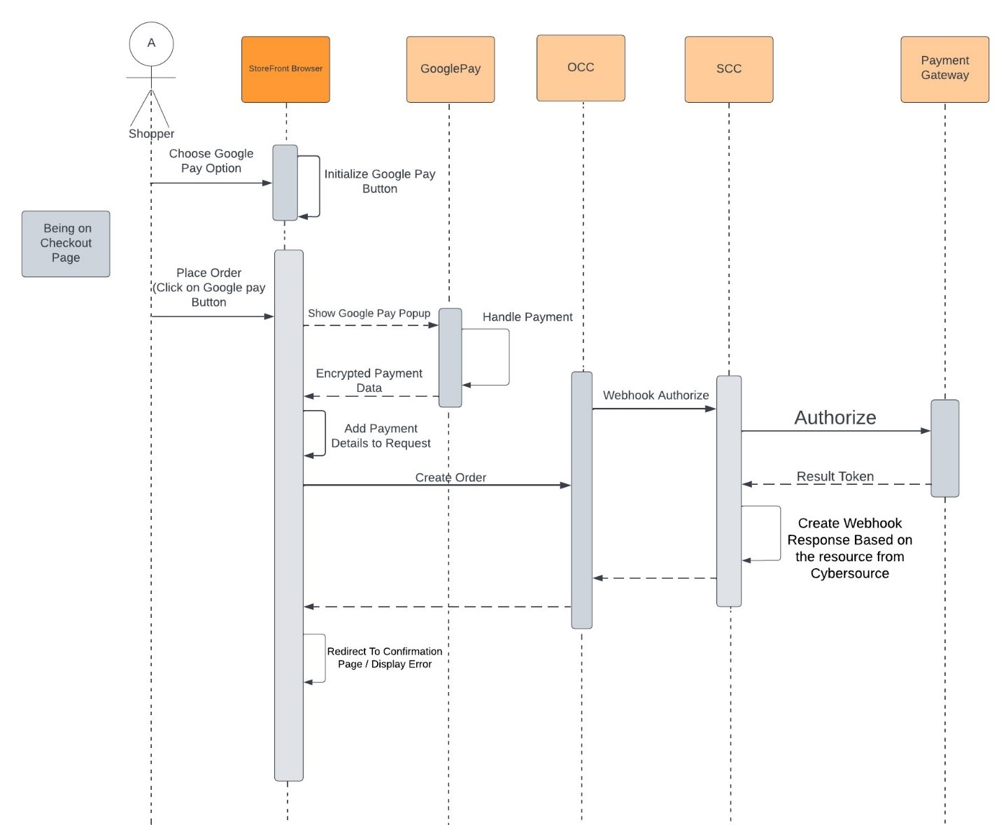

# GooglePay <!-- omit in toc -->

1. [Description](#description)
2. [Implementation Details](#implementation-details)
   1. [Configuration](#configuration)
   2. [Payment Steps](#payment-steps)
   3. [UI integration details](#ui-integration-details)
   4. [Backend (SSE) integration details](#backend-sse-integration-details)

## Description

Google Pay is a simple, secure in-app mobile and Web payment solution.

For more details, please refer to [REST API development guide](https://developer.cybersource.com/api/developer-guides/dita-payments/CreatingOnlineAuth/CreatingAuthReqGooglePay.html) document

UI integration process is documented in the following [tutorial](https://developers.google.com/pay/api/web/guides/tutorial). Familiarize yourself with [Integration Checklist](https://developers.google.com/pay/api/web/guides/test-and-deploy/integration-checklist).

GooglePay payment service includes the following payment operations:

- Authorization
- Authorization Reversal (VOID)
- Capture
- Refund

## Implementation Details

### Configuration

The following gateway settings apply to GooglePay payments

| **Setting**                         | **Description**                                                                                                                                                                                                                                                                                                   |
|-------------------------------------|-------------------------------------------------------------------------------------------------------------------------------------------------------------------------------------------------------------------------------------------------------------------------------------------------------------------|
| **googlePaySdkUrl**                 | GooglePay SDK URL                                                                                                                                                                                                                                                                                                 |
| **googlePayEnvironment**            | GooglePay environment                                                                                                                                                                                                                                                                                             |
| **googlePayGateway**                | To retrieve payment and customer information from a payment gateway that's supported by the Google Pay API. Gateway's identifier, which is issued by Google                                                                                                                                                       |
| **googlePayGatewayMerchantId**      | To retrieve payment and customer information from a payment gateway that's supported by the Google Pay API. Your gateway account ID, which is provided by the gateway                                                                                                                                             |
| **googlePayMerchantId**             | A Google merchant identifier issued after registration with the Google Pay Business Console. Required when PaymentsClient is initialized with an environment property of PRODUCTION. See Request production access for more information about the approval process and how to obtain a Google merchant identifier |
| **googlePayMerchantName**           | Merchant name encoded as UTF-8. Merchant name is rendered in the payment sheet. In TEST environment, or if a merchant isn't recognized, a “Pay Unverified Merchant” message is displayed in the payment sheet                                                                                                     |
| **googlePaySupportedNetworks**      | GooglePay Supported networks                                                                                                                                                                                                                                                                                      |

Default values:

- `googlePayEnvironment`: 'TEST'. See [Deploy production environment](https://developers.google.com/pay/api/web/guides/test-and-deploy/deploy-production-environment) before switching to 'PRODUCTION'
- `googlePaySdkUrl`: 'https://pay.google.com/gp/p/js/pay.js'. SDK is loaded by Payment Widget
- `googlePaySupportedNetworks`: 'AMEX,DISCOVER,INTERAC,JCB,MASTERCARD,VISA'. Update supported card networks as per  your requirement. Can be managed in OCC Admin

### Payment Steps

In OCC context GooglePay payment happens as follows:

1. GooglePay payment option is rendered by the Payment Selector component
2. GooglePay Javascript library is evaluated and decides whether GooglePay button should be displayed
3. Shopper chooses to pay with GooglePay by clicking the button
4. As a result of successful authentication process GooglePay returns encrypted payment data
5. Generic payment is added to the list and encrypted payment blob is added to custom payment properties
6. OCC order creation endpoint is called
7. Generic "Authorize" Webhook is triggered with custom payment data
8. Payment is authorized by SSE and result is returned back to storefront



### UI integration details

GooglePay UI component can is located in Payment Widget:

```text
plugins
 ├── components
 | ├── isv-payment-method
 | | ├── components
 | | | └── isv-googlepay-payment-method
 | | | | ├── googlepay.css
 | | | | ├── googlePay.js
 | | | | └── index.jsx
 | | ├── isv-payment-utility
 | | | ├── common.js
 | | | └── script-loader.js
 | | ├── index.jsx
 | | ├── meta.js
 | | └── styles.css
 | ├── index.js
 | └── meta.js
 ├── endpoints
 | ├── payment-method-config-endpoint
 | | ├── index.js
 | | └── meta.js
 | ├── index.js
 | └── meta.js
 ├── fetchers
 | ├── payment-method-config-fetcher
 | | ├── hook.js
 | | ├── index.js
 | | └── meta.js
 | ├── hooks.js
 | ├── index.js
 | └── meta.js
 └── selectors
   ├── payment-method-config-selector
   | └── index.js
   └── index.js

```

- Before Payment Widget is rendered available payment methods are retrieved from SSE `/ccstorex/custom/isv-payment/v2/paymentMethods` endpoint
- GooglePay SDK is loaded (see `googlePaySdkUrl` gateway setting)
- GooglePay button is added in case it is supported by shopper's device  otherwise a message is displayed saying the payment method is not supported
- On clicking the GooglePay button payment is initiated by creating payment request and showing payment sheet (pop-up window) to the shopper
- Once shopper proceeds with selected payment method from the sheet payment details are updated with encrypted payment token

### Backend (SSE) integration details

List of related controllers:

- `server-extension/src/controllers/paymentMethods.ts` - returns supported payment method configurations

The list of handlers processing GooglePay Webhook requests in SSE can be found in `server-extension/src/services/payments/index.ts`

| **Operation**              | **Handlers**                           | **Description**                                                                                                  |
|----------------------------|----------------------------------------|------------------------------------------------------------------------------------------------------------------|
| **generic_googlepay_0100** | `googlepayAuthorizationRequest`        | converts Webhook request into payment PSP request                                                                |
|                            | `processPayment`                       | sends payment request to PSP using client SDK                                                                    |
|                            | `genericAuthorizationResponse`         | converts PSP response into Webhook response                                                                      |
|                            |                                        |                                                                                                                  |
| **generic_0110**           | `referenceInfoFallback`                | in case authorization transaction id is not sent by OCC fallback to the one found in order data fetched from OCC |
|                            | `authorizationReversalRequest`         | converts Webhook request into reversal PSP request                                                               |
|                            | `processAuthorizationReversal`         | sends reversal request to PSP using client SDK                                                                   |
|                            | `genericAuthorizationReversalResponse` | converts PSP response into Webhook response                                                                      |
|                            |                                        |                                                                                                                  |
| **generic_0400**           | `referenceInfoFallback`                | in case authorization transaction id is not sent by OCC fallback to the one found in order data fetched from OCC |
|                            | `refundRequest`                        | converts Webhook request into refund PSP request                                                                 |
|                            | `processRefund`                        | sends refund request to PSP using client SDK                                                                     |
|                            | `genericAuthorizationReversalResponse` | converts PSP response into Webhook response                                                                      |
