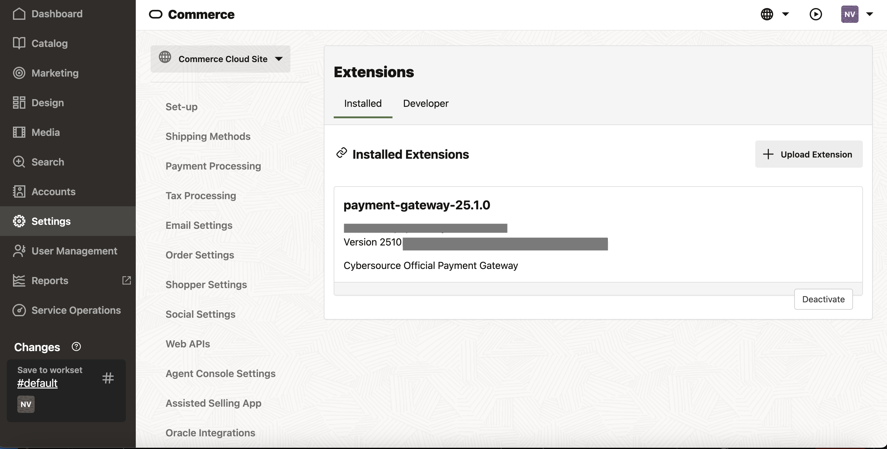
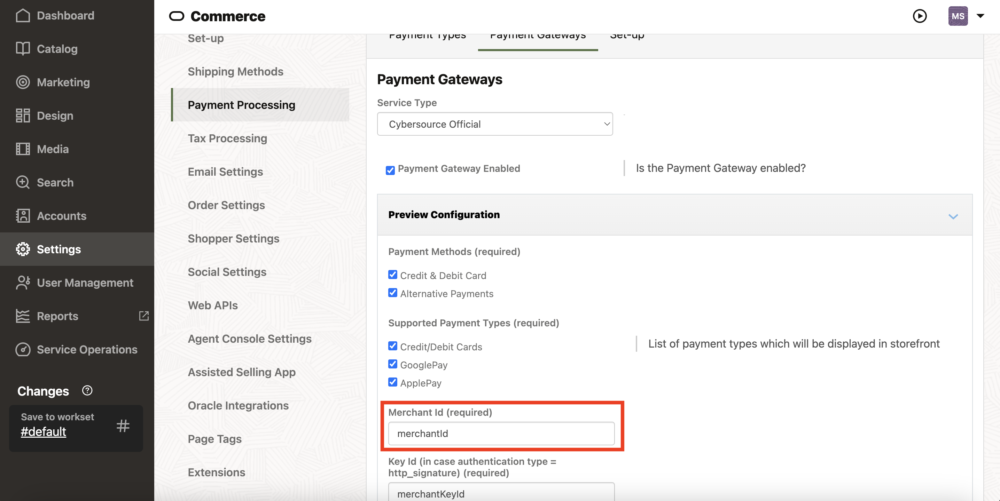

# Support

If you require support with this software, please contact GlobalPartnerSolutionsCS@visa.com and provide the following details:
- Summary of the issue
- Steps to reproduce the issue
- Oracle Commerce Cloud Platform version: You can find Oracle Commerce Cloud Platform Version in Oracle Commerce Cloud Backoffice dashboard.

- Plugin/ Extension version: Under Settings->Extension, find the version of the installed Cybersource Official Payment Gateway extension.

- Cybersource Merchant ID: Under Settings->Payment Processing, Select Cybersource Official from the Service Type dropdown, find the Merchant Id.

- Order ID/ Merchant Reference Number: Order ID can be found in Order Confirmation Page or under Order History.
- Configuration screenshots: Please provide screenshots of Cybersource Official Configurations.
- Log file and other relevant data: Download the **debug** and **error** logs from Oracle Commerce Cloud using getExtensionServerLogs admin endpoint.